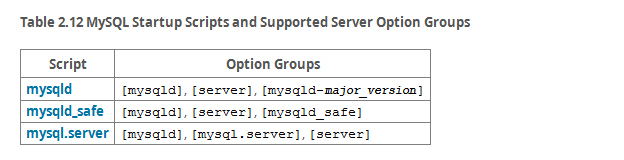

## [2.10.5 Starting and Stopping MySQL Automatically](http://dev.mysql.com/doc/refman/5.7/en/automatic-start.html)

在类 Unix 系统上，可以使用 **mysqld_safe** 来操控 **mysqld**。

在支持 System V-system 的系统上，运行在 `/etc/init.d` 目录下的 **mysql.server**。这个脚本通常在系统启动和关闭的时候使用，通常会命名为 **mysql**。**mysql.server** 脚本在启动的时候会操作 **mysqld_safe**。

The following table shows which option groups the server and startup scripts read from option files.

`[mysqld-major_version]` means that groups with names like `[mysqld-5.6]` and [mysqld-5.7] are read by servers having versions 5.6.x, 5.7.x, and so forth. This feature can be used to specify options that can be read only by servers within a given release series.

For backward compatibility, mysql.server also reads the `[mysql_server]` group and mysqld_safe also reads the [safe_mysqld] group. To be current, you should update your option files to use the [mysql.server] and [mysqld_safe] groups instead.