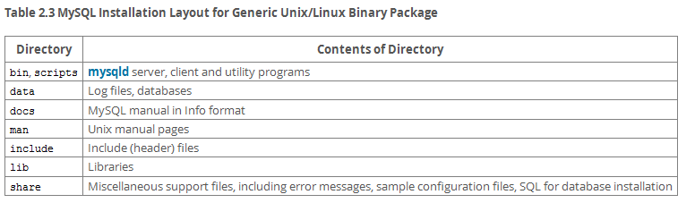

## [2.2 Installing MySQL on Unix/Linux Using Generic Binaries](http://dev.mysql.com/doc/refman/5.7/en/binary-installation.html)

> 如果之前安装过MySQL，先完全卸载，包括配置文件，如：/etc/my.cnf 或 /etc/mysql目录。 

> MySQL 依赖 **libaio** 库。如果需要，下载安装：

~~~bash
shell> yum search libaio  # search for info
shell> yum install libaio # install library
~~~

> 或者

~~~bash
shell> apt-cache search libaio # search for info
shell> apt-get install libaio1 # install library
~~~

[Download mysql-5.7.12-linux-glibc2.5-x86_64.tar.gz](http://cdn.mysql.com//Downloads/MySQL-5.7/mysql-5.7.12-linux-glibc2.5-x86_64.tar.gz)

~~~bash
shell> groupadd mysql
shell> useradd -r -g mysql -s /bin/false mysql
shell> cd /usr/local
shell> tar zxvf /path/to/mysql-VERSION-OS.tar.gz
shell> ln -s full-path-to-mysql-VERSION-OS mysql
shell> cd mysql
shell> mkdir mysql-files data
shell> chmod 750 mysql-files data
shell> chown -R mysql .
shell> chgrp -R mysql .
shell> bin/mysql_install_db --user=mysql    # Before MySQL 5.7.6
shell> bin/mysqld --initialize --user=mysql # MySQL 5.7.6 and up
shell> bin/mysql_ssl_rsa_setup              # MySQL 5.7.6 and up
shell> chown -R root .
shell> chown -R mysql data mysql-files
shell> bin/mysqld_safe --user=mysql &
# Next command is optional
shell> cp support-files/mysql.server /etc/init.d/mysql
shell> export PATH=$PATH:/usr/local/mysql/bin

shell> mysql -u root -p # --initialize
shell> mysql -u root --skip-password # --initialize-insecure
mysql> ALTER USER 'root'@'localhost' IDENTIFIED BY 'new_password';
~~~

> 使用 **useradd** 命令的 -r 和 -s */bin/false* 选项创建一个不用登陆的账号。如果 **useradd** 不支持这些选项，可以省略。